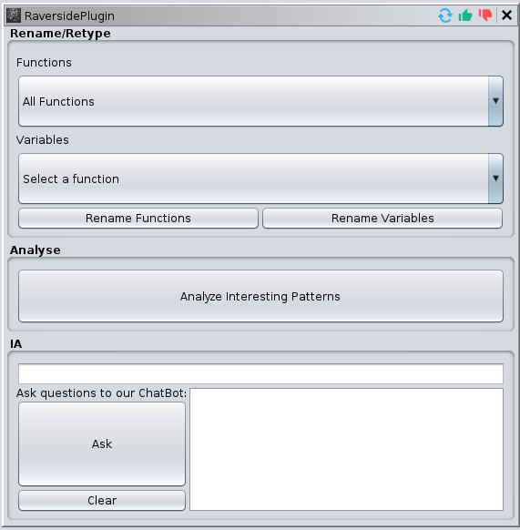
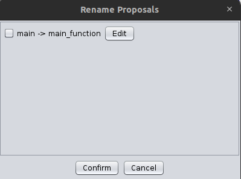

# RAversIde Plugin for Ghidra

## Overview
**RAverSIde** is an artificial intelligence (AI)-driven reverse engineering assistant designed specifically to integrate with the well-known Ghidra application. It's not just another tool, it's a revolution. RAverSIde transforms the traditional, often complex reverse engineering process into a fluid, efficient and remarkably more accurate process.

## Features
- **Automatic renaming**: Suggests new names for functions and variables based on their actions in the code.
- **Code analysis**: Detects and comments on potential vulnerabilities in the code.
- **AI chatbot**: Ask the AI questions and get contextual answers, including specific code analysis.

## Configuration and Dependencies

### 1. Introduction and Objectives of the Plugin

- **General Presentation of the Plugin**:
    - Obtain valuable assistance in detecting vulnerabilities, cryptographic algorithms, and malicious code using AI.

- **Objectives and Key Features**:
    - The purpose of our plugin is to integrate our RAversIde tool into Ghidra.
    - It is capable of interacting with the software to perform actions such as highlighting or adding comments.
    - Communicates with a Rust API, sending code required by the user for an AI to process the information and return the addresses to be commented or highlighted.

### 2. Plugin Installation

To install the plugin:

1. Navigate to `file` -> `install extensions`.

   

2. Click the  icon.

3. Select our `.zip` from our GitHub repository, click `ok`, and then restart Ghidra.

After restarting, our plugin window should appear when you launch an executable for analysis.

## How It Works?

This is what the plugin looks like:

## Usage

### Renaming Functions and Variables

1. **Select Function or Variable**: Use the `Functions` and `Variables` drop-down menus to select the items you wish to rename.

2. **Rename**: Click the `Rename Functions` or `Rename Variables` buttons for AI suggestions.

3. **Manage Suggestions**: Suggestions will appear in a `Rename Proposals` window. You can choose to accept them or edit them manually.

4. **Apply Changes**: Use the checkboxes to select the desired renames, then click `Confirm` to apply.

   

### Code Analysis

- Click the `Analyze Interesting Patterns` button to have the AI analyze the code of the selected function. Detected vulnerabilities will be commented and highlighted in the Ghidra interface.

### Chatbot AI

1. **Ask a Question**: Type your question in the text box under `Ask questions to our ChatBot`.

2. **Select the Context**: If you want the question to be about a specific function, choose it from the `Functions` drop-down menu.

3. **Get Answers**: Click `Ask` to send the question. The answer will appear in the large text box below.

    
# Plugin architecture

## Main Class : RaversidePlugin

1. **Class Definition**: **`RaversidePlugin`** extends **`ProgramPlugin`**, indicating it's a Ghidra program plugin.
2. **Constructor**: The constructor initializes **`ApiManager`**, **`FeatureManager`**, and **`Helper`** objects, and sets up a provider (**`MyProvider`**) with a help location.
3. **Initialization**: The **`init()`** method is currently a placeholder for future initialization logic.
4. **Program Activation Handling**: The **`programActivated(Program p)`** method sets the current program and refreshes the provider.
5. **Inner Class - `MyProvider`**: This is a subclass of **`ComponentProvider`**, responsible for the UI component of the plugin. It includes several panels and user interaction elements like buttons, combo boxes, and text areas.
6. **UI Components**:
    - **Panels**: There are different panels for various functionalities like renaming, retyping, analysis, and interaction with an AI
    - **Actions**: Actions for renaming functions and variables, analyzing patterns, adding comments, etc., are implemented with buttons and listeners.
7. **Documentation for each method**
    1. **refresh**
        - **Purpose**: Refreshes the UI components, particularly the function combo boxes, with updated information from the current program. Refresh is used after a rename, and at plugin startup.
        - **Functionality**: Retrieves functions from the current program and updates the function combo boxes accordingly.
    2. **buildPanel**
        - **Purpose**: Constructs the main panel of the plugin.
        - **Functionality**: Initializes the **`textArea`** and sets up the main **`panel`** with sub-panels for different functionalities.
    3. **buildRenameRetypePanel**
        - **Purpose**: Creates the panel dedicated to renaming and re-typing functionalities.
        - **Components**: Includes combo boxes and buttons for renaming functions and variables.
    4. **buildOtherPanel**
        - **Purpose**: Constructs the panel for analysis-related functionalities.
        - **Functionality**: Sets up components for adding comments, highlighting patterns, and analyzing patterns.
    5. **buildIAPanel**
        - **Purpose**: Sets up the panel for interacting with an AI.
        - **Components**: Includes a text area for displaying responses and buttons for sending queries and clearing responses.
    6. **Action Methods**: **`addCommentsAction`**, **`highlightPatternsAction`**, **`analysePatternsAction`**
        - **Purpose**: Define actions for the respective buttons. These actions involve interacting with the Ghidra program, such as adding comments, highlighting patterns in the code, and sending requests for analysis.
    7. **Supporting Methods**: **`buildComboAndTextFieldPanel`**, **`buildButtonsPanelRename`**, **`initializeComponents`**, **`setupListeners`**, **`createConditionalDropdownPanel`**, **`buildIALeftPanel`**, **`buildValidationButton`**, **`buildClearButton`**, **`buildQuestionArea`**
        - **Purpose**: These methods support the main functionality by creating UI components, setting up listeners for actions, and organizing the layout of the panels.
    
    ### **`RenameDialog` Class**
    
    ### Overview
    
    - **Purpose**: **`RenameDialog`** is a custom dialog window for presenting rename proposals to the user. It allows users to select which items they want to rename.
    - **User Interaction**: The dialog presents a list of items to be renamed, each with a checkbox. Users can select which items they wish to rename and confirm their choices. If they wish to modify the new name proposed by the AI, there is an "edit" button on the side of the proposal.
    - **Integration**: This dialog is likely integrated into a larger renaming feature within the plugin, where it is used to collect user input on which items should be renamed based on proposed names.
    
    ### Constructor
    
    - **Parameters**:
        - **`List<RenameItem> renameItems`**: A list of **`RenameItem`** objects to display in the dialog.
    
    ### Methods
    
    1. **initUI**
        - **Purpose**: Initializes the user interface of the dialog.
    2. **createRenamePanel**
        - **Purpose**: Creates the main panel displaying the rename options.
    3. **formatRenameText**
        - **Purpose**: Formats the text for rename items.
    4. **createButtonPanel**
        - **Purpose**: Creates the panel containing the 'Confirm' and 'Cancel' buttons.
    5. **isConfirmed**
        - **Purpose**: Indicates whether the 'Confirm' button was clicked.
    6. **getSelectedItems**
        - **Purpose**: Retrieves a list of selected **`RenameItem`** objects.
    
    ### **`RenameItem` Nested Class**
    
    ### Overview
    
    - **Purpose**: Represents an item to be potentially renamed, containing information about its current and proposed names, type, and associated function.
    
    ### Constructor
    
    - **Signature**: **`public RenameItem(String old_name, String new_name, String item_type, Function function)`**
    - **Parameters**:
        - **`String old_name`**: The current name of the item.
        - **`String new_name`**: The proposed new name for the item.
        - **`String item_type`**: The type of the item.
        - **`Function function`**: The associated function.
    
    ### Methods
    
    1. **getOldName**
        - **Returns**: The current name of the item.
    2. **getNewName**
        - **Returns**: The proposed new name for the item.
    3. **getItemType**
        - **Returns**: The type of the item.
    4. **getFunction**
        - **Returns**: The associated Ghidra **`Function`** object.
    5. **setNewName**
        - **Set**: The new name manually modified.
    
    ### **`Helper` Class Overview**
    
    ### Purpose
    
    - **`Helper`** is a utility class designed to assist in various tasks within the Ghidra plugin, especially in creating JSON requests for different operations such as renaming functions and variables, and preparing requests for a chatbot or analysis.
    
    ### Methods
    
    1. **createRenameFunctionRequestJson**
        - **Purpose**: Creates a JSON request for renaming a function.
        - **Returns**: **`JsonObject`** representing the rename request.
    2. **createRenameVariableRequestJson**
        - **Purpose**: Creates a JSON request for renaming a variable.
    3. **buildJsonRequest**
        - **Purpose**: Builds a generic JSON request object.
    4. **addFunctionCodeToJson**
        - **Purpose**: Adds function code (both assembly and decompiled C) to the JSON request.
    5. **getFunctionByName**
        - **Purpose**: Retrieves a function by its name from the program.
    6. **getVariableByName**
        - **Purpose**: Retrieves a variable by its name within a function context.
    7. **createChatBotRequest**
        - **Purpose**: Creates a JSON request for the chatbot feature.
    8. **prepareAnalysisRequest**
        - **Purpose**: Prepares a JSON request for program analysis.
    

### **`FeatureManager` Class Overview**

### Purpose

- The **`FeatureManager`** class is designed to manage and execute various features in the Ghidra plugin, like renaming functions and variables, processing analysis responses, and handling comments and coloring in the code.

### Methods

1. **renameFunction**
    - **Purpose**: Initiates the renaming of a function.
2. **renameVariable**
    - **Purpose**: Initiates the renaming of a variable.
3. **processRenameResponse**
    - **Purpose**: Processes the response from a rename request.
4. **renameSelected**
    - **Purpose**: Performs the renaming operation for selected items.
5. **addFunctionCodeToRequest**
    - **Purpose**: Adds function code details to a JSON request.
6. **processAnalysisResponse**
    - **Purpose**: Processes the response from an analysis request.
7. **processComment**
    - **Purpose**: Processes a comment from a JSON element and applies it to the code unit.
8. **parseColor**
    - **Purpose**: Parses a color string to a **`Color`** object.
9. **SetColor**
    - **Purpose**: Sets or clears the background color of a code unit.
10. **setMultilineComment**
    - **Purpose**: Sets a multiline comment for a code unit.

### **`ApiManager` Class Overview**

### Purpose

- The **`ApiManager`** class is responsible for managing API calls in the Ghidra plugin. It sends asynchronous requests to the rust server and handles responses, including real-time chatbot interactions through a WebSocket connection.

### **Functionality and Usage**

- **`ApiManager`** serves as a bridge between the Ghidra plugin and external APIs, handling tasks like renaming, chatbot interactions, and code analysis.
- It utilizes an asynchronous model with a single-threaded executor service for non-blocking operations.
- The class employs a lock mechanism to prevent concurrent API calls that might lead to unpredictable results.
- A significant enhancement is the addition of a WebSocket for real-time communication with chatbot services, specifically for handling responses from a ChatGPT-like model.

### **Integration with Ghidra**

- The class utilizes Ghidra’s services, such as **`ConsoleService`** for logging messages and errors, to provide feedback on the API operations.

### Methods

1. **sendRenameFunctionRequest**
    - **Purpose**: Sends an asynchronous request to rename a function.
2. **sendRenameVariableRequest**
    - **Purpose**: Sends an asynchronous request to rename a variable.
3. **sendChatBotRequest**
    - **Purpose:** Sends an http request to the chatbot service, but connect to the rust to receive the response in the WebSocket
4. **sendAnalysisRequest**
    - **Purpose**: Sends an asynchronous request for code analysis.
5. **sendHttpRequestAsync**
    - **Purpose**: Handles the asynchronous sending of HTTP requests.
6. **sendHttpRequest**
    - **Purpose**: Executes an HTTP POST request to the specified route with the given request data.

### **WebSocket Integration for Chatbot Communication**

- The class now incorporates a WebSocket client (**`MyWebSocketClient`**) for real-time interaction with the chatbot service.
- This WebSocket client is used specifically for chatbot requests, establishing a connection for immediate response reception and processing.
- The method **`handleWebSocketResponse`** is responsible for processing messages received from the WebSocket, displaying them in Ghidra's interface, and handling the closure of the WebSocket connection.

# AutoUpdateGhidraPlugin.sh

A problem was encountered while exporting plugins from Eclipse for Ghidra.

Our initial situation with Ghidra and the plugin update process was quite tedious, requiring three distinct restarts for each plugin update:

1. **Removal of the Old Plugin**: The first restart of Ghidra was necessary to remove the old plugin. This step ensured that the old version of the plugin was no longer active or loaded in the application.
2. **Adding the New Plugin**: Next, a second restart was required to add the new plugin. This step involved integrating the updated plugin into the Ghidra environment, but the plugin was not yet fully operational.
3. **Activation of the New Plugin**: Finally, a third restart of Ghidra was necessary for the new plugin to be fully accounted for and active in the application. Only after this step could the updated plugin be used effectively.

To solve this problem, which required 3 restarts of Ghidra for each plugin update, a script was created.

The script, written in Bash, automates the plugin update process in Ghidra. Here's a simplified explanation of how it works:

1. **Monitoring the Plugin File**: The script continuously monitors the last build of your plugin. It regularly checks if this file has been modified.
2. **Closing Ghidra**: When a modification is detected in the plugin file, the script searches for the Ghidra process that is running and closes it.
3. **Updating the Plugin**: After closing Ghidra, the script extracts the modified plugin ZIP file into Ghidra's extension directory.
4. **Restarting Ghidra**: Finally, the script automatically restarts Ghidra.

Thus, this script reduces the process of updating plugins for Ghidra to a single automatic step, eliminating the need for multiple manual restarts.